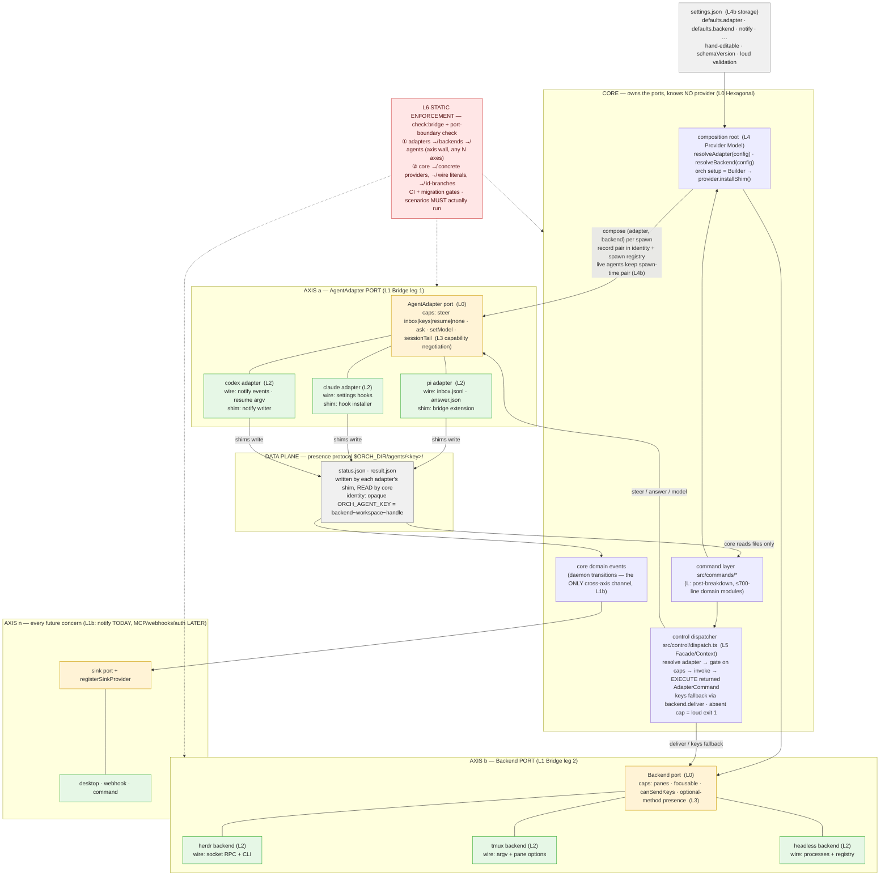
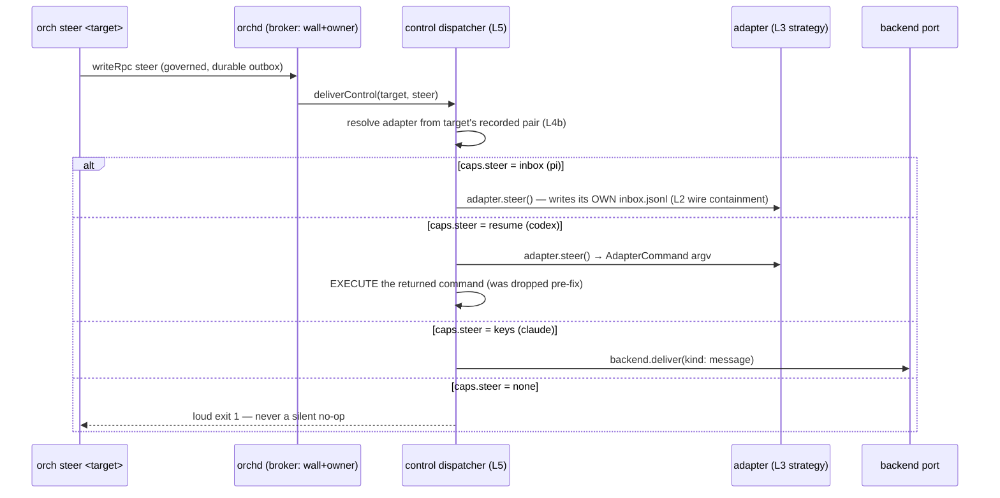

# orch — pattern architecture chart

How the pattern stack (`docs/reference/design-patterns.md`, binding per `learnings/2026-07-16-harness-plexer-architecture.md`) fits together as one machine. This is the **target end-state after the six open changes land**; the comparison at the bottom maps it against the two existing architecture charts.

## The pattern machine

## One control message through the machine (steer, per adapter strategy)

## Comparison vs the existing charts

| | `docs/charts/old/system-asbuilt-2026-07-15.md` (as-built chart) | `docs/charts/old/broker-target-2026-07-15.md` (broker chart) | **this chart (pattern machine)** |
|---|---|---|---|
| **Question it answers** | "what runs today and in what order" | "which writes go through the daemon" | "why any harness×plexer combination works and what stops it regressing" |
| **Adapter axis** | one box "AgentAdapter: pi \| claude \| codex" — hides that only pi was wired | same single box | three concrete adapters, each with its **own wire format and shim**, behind one caps-negotiated port |
| **The defect, visibly** | the defect is *in* the chart as normal flow: `OB → deliverBackend: … piAdapter.steer` and `SM → inbox.jsonl` — pi hardcoded inside the broker, drawn as if universal | same: "message delivery" arrows terminate in the pi inbox; adapter heterogeneity invisible | the L5 dispatcher + per-caps strategy branches make the pi-only path impossible to draw — there is no arrow from core to `inbox.jsonl` |
| **Control plane** | CLI → RPC → govern → outbox → backend/pi-inbox (no adapter dispatch step) | RPC → broker → backend (adapter step absent) | broker → **dispatcher → adapter strategy** → backend fallback; the missing L5 layer is explicit |
| **Capabilities** | listed only for backends (`panes, focusable, canSendKeys`) | same | both axes carry caps; caps are the *branching mechanism*, drawn as the alt-paths of the sequence diagram |
| **Settings/composition** | `config.toml` box, no consumer arrows to selection | `configWatch` only | `settings.json → composition root → per-spawn recorded pair`, re-pairing + mixed fleets (L4b) first-class |
| **Enforcement** | absent | absent | L6 box gating all three boundaries — the layer whose absence let the agent axis rot |
| **N-axis growth** | notify sinks drawn as daemon internals | same | notify drawn as **axis n** with the same port+registry shape, the template for MCP/webhooks/auth |
| **Honesty about state** | claims "Bridges are plexer-agnostic" (true for identity, false for the herdr-wired HUD half) | claims broker/governance "IMPLEMENTED" while steer terminates in pi's inbox | target-state chart, explicitly labeled as post-six-changes; conformance table lives in `docs/reference/design-patterns.md` |

**Bottom line:** the two existing charts are *flow* charts — they show plumbing order and both faithfully drew the pi-hardcoded delivery path as if it were the universal protocol, which is exactly how the defect stayed invisible. This chart is a *contract* chart: it draws the boundaries (ports, wire containment, caps, dispatcher, enforcement), so a pi-only arrow from core to `inbox.jsonl` is not drawable without visibly crossing a red boundary. After the six changes land, `docs/charts/old/system-asbuilt-2026-07-15.md` should be regenerated to match this shape (that's covered by monolith-file-breakdown's doc task).
