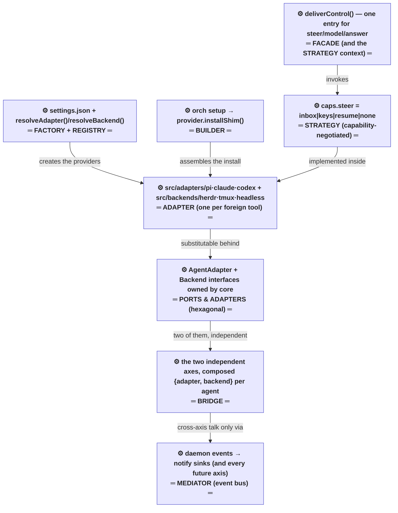
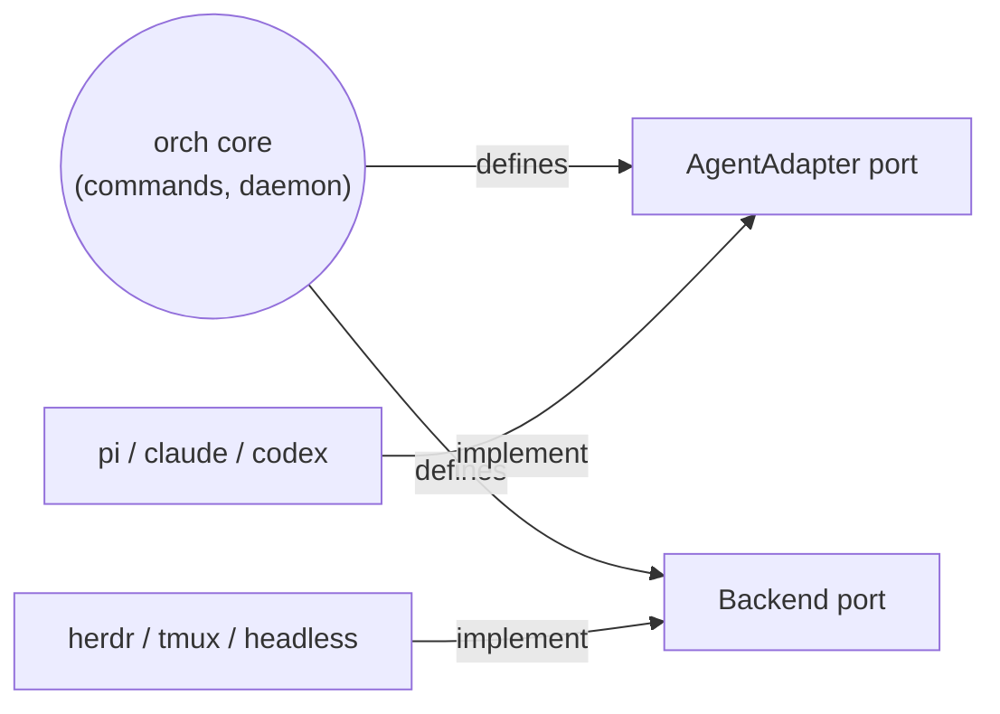
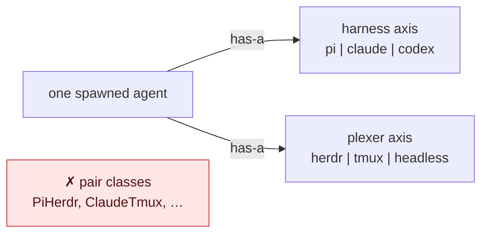
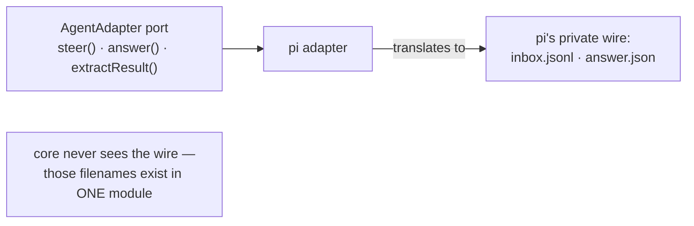
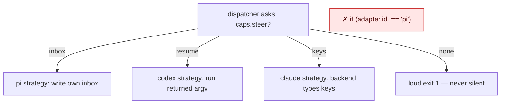
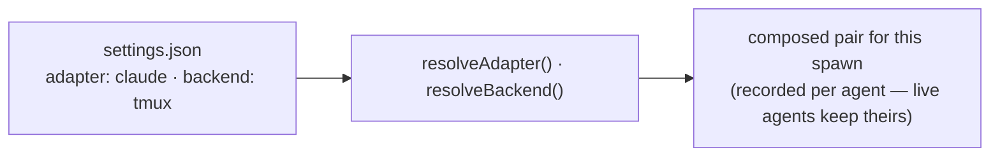
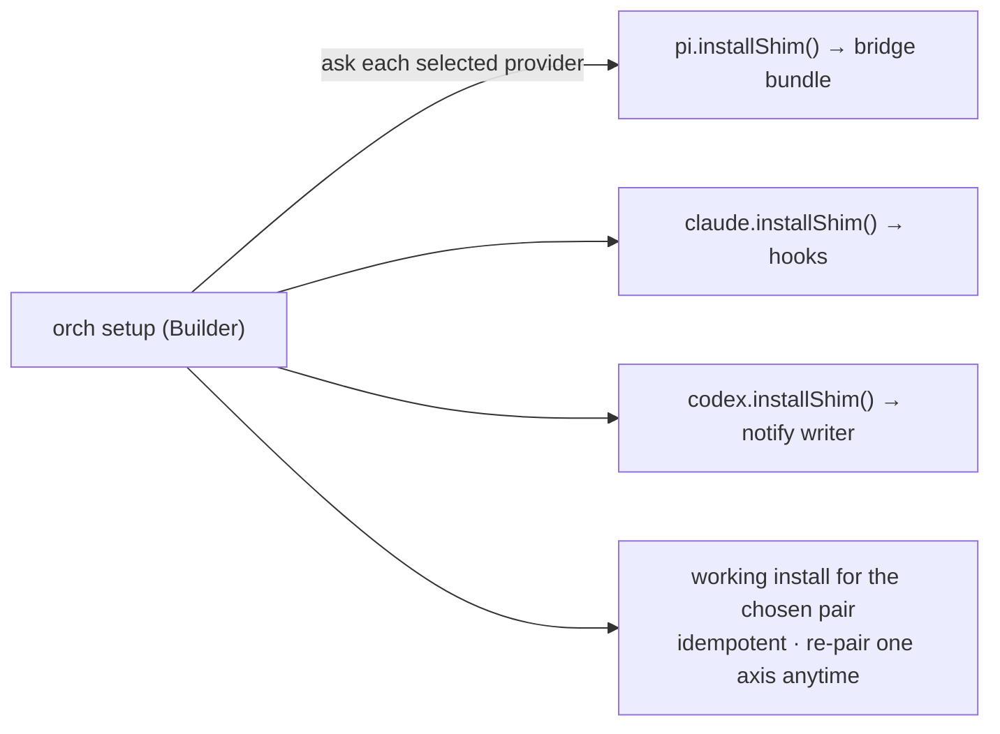
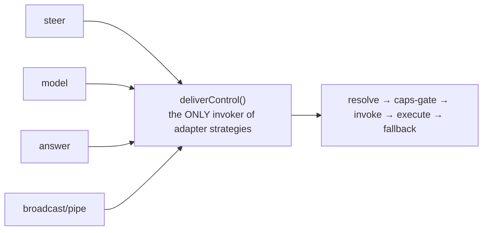
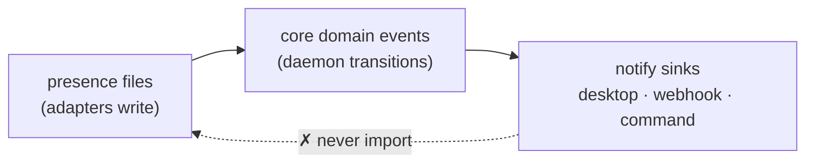

# orch — design-pattern showcase

Which part of orch is which design pattern, why that pattern was chosen for that part, and each pattern's textbook shape with orch's real pieces in the roles. Binding source: `docs/reference/design-patterns.md` + `learnings/2026-07-16-harness-plexer-architecture.md`. System wiring lives in `docs/charts/current/target-system-wiring.md`; this doc is ONLY about the patterns.

## The map — which part of orch is which pattern

| Part of the system | Pattern | Why this pattern is the right one (vs the alternative) |
|---|---|---|
| `AgentAdapter` + `Backend` interfaces, owned by core | **Ports & Adapters** | Core must not depend on tools it doesn't control. Alternative — calling tools directly from core — is what actually happened on the agent side: pi's file protocol colonized orchd and commands.ts. |
| harness axis × plexer axis, composed per agent | **Bridge** | Two dimensions that vary independently. Alternative — pair classes or a merged runner — costs a×b units and every new tool multiplies work; Bridge makes it a+b. Design.md D1 already rejected Strategy-only here: Strategy swaps algorithms you *own*; these are foreign systems. |
| `adapters/pi.ts`, `claude.ts`, `codex.ts`, `backends/herdr`, `tmux`, `headless` | **Adapter (GoF)** | Each foreign CLI has an incompatible native interface (file inbox vs hooks vs resume; socket vs argv vs processes). Only a per-tool wrapper makes them substitutable; the wire format must live inside its wrapper or the pattern is fiction. |
| `caps` flags + per-mechanism steer/answer behavior | **Strategy, selected by capability negotiation** | The harnesses genuinely differ in ability. Branching on declared caps (LSP/Terraform precedent) absorbs the difference honestly; the alternative — `if (adapter.id !== "pi")` — is the exact anti-pattern found at commands.ts:1149. |
| `deliverControl()` — the single control entry | **Facade / Strategy-context** | Strategies are only real if exactly one context invokes them. orch had strategies with no context, so call sites inlined pi's path. The Facade is the missing piece, not an extra layer. |
| `settings.json` → `resolveAdapter()`/`resolveBackend()` | **Factory + Registry (Provider Model)** | "Any user, any combination, changeable anytime" is config-driven object selection — the factory's literal job. Alternative — constructing providers at call sites — bakes the pair and kills re-pairing. |
| `orch setup` calling each provider's `installShim()` | **Builder** | Assembly steps differ per provider and per pair. The Builder asks each provider to install itself; the alternative — `if (harness === "pi") …` blocks in setup — is the pre-fix code and can't scale to new providers. |
| daemon events → notify sinks (→ any future axis: MCP, webhooks, auth) | **Mediator (event bus)** | N axes stay additive only if they never import each other. The event bus is the one sanctioned meeting point — proven in-repo by notify staying clean while everything else rotted. |
| `check:bridge` + port-boundary check | *(not GoF — enforcement)* | Patterns regress to inlining without a mechanical guard: the checked plexer axis stayed clean, the unchecked agent axis rotted. The static check is what makes the other eight rows permanent. |

## The patterns, simply — one small chart each

Each diagram is the pattern's textbook shape with orch's real pieces dropped into the roles. Read "why it fits" as: this is the problem the pattern exists for, and orch has exactly that problem.

### 1 · Ports & Adapters (Hexagonal) — core defines interfaces, providers implement them

**How:** core only ever calls the two interfaces; every concrete tool lives outside them.
**Why it fits:** the tools are foreign programs orch doesn't control — dependency must point inward or core fills up with tool-specific code (which is exactly what happened on the agent side pre-fix).

### 2 · Bridge — two independent hierarchies, composed, never multiplied

**How:** an agent is a *composition* of one pick from each axis, recorded at spawn. The axes never reference each other.
**Why it fits:** 3 harnesses × 3 plexers = 9 combinations but only 6 modules. Without Bridge, every new tool multiplies work instead of adding it.

### 3 · Adapter (GoF) — one wrapper per foreign tool, wire format stays inside

**How:** each adapter converts port calls into its tool's native mechanism (pi: file inbox, claude: hooks/keystrokes, codex: `codex resume`).
**Why it fits:** the tools have incompatible native interfaces; an Adapter is the only way to make them substitutable behind one port.

### 4 · Strategy + capability negotiation — behavior chosen by declared caps, never by name

**How:** every adapter declares what it can do (`caps`); callers branch on the declaration — LSP/Terraform style.
**Why it fits:** the harnesses have genuinely different abilities. Caps absorb that difference honestly; id-checks (the pre-fix code) hide it and rot.

### 5 · Factory + Registry (Provider Model) — settings pick the providers

**How:** one composition root reads user config and hands back provider instances; nothing else constructs or selects providers.
**Why it fits:** "any user, any combination, changeable anytime" is config-driven creation — the factory's exact job.

### 6 · Builder — setup assembles a working installation pairwise

**How:** setup doesn't know how any integration is installed — it asks each provider to install its own.
**Why it fits:** assembly steps differ per provider; putting them in setup as `if (harness === …)` branches (the pre-fix code) is the anti-Builder.

### 7 · Facade — one dispatcher fronts all control traffic

**How:** every command and the daemon call one function; the strategy machinery is invisible behind it.
**Why it fits:** GoF Strategy only works with a single context that owns invocation. orch built strategies with no context — call sites bypassed them. The Facade IS the missing context.

### 8 · Mediator (event bus) — axes talk through core events, never to each other

**How:** a third axis (notify — already live and clean) consumes events carrying identity; it knows nothing about pi or herdr.
**Why it fits:** N axes stay additive only if cross-axis knowledge is zero; the event bus is the one sanctioned meeting point.

