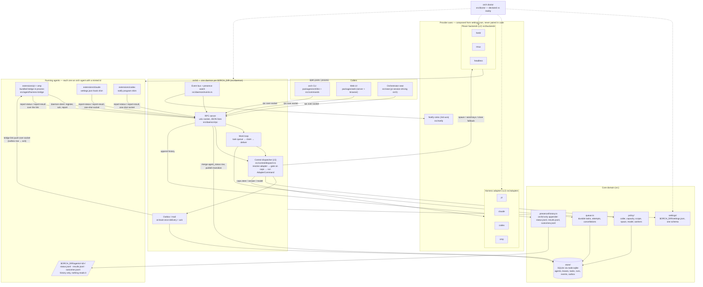

# orch architecture

High-level view of how the pieces fit. The binding rules are in `CLAUDE.md` (Rules 9, 10, 11) and `learnings/2026-07-16-harness-plexer-architecture.md`; this diagram is the picture, those are the law.

## Reading it

- **One daemon, one dispatcher.** Every caller (CLI, web, an orchestrator seat) talks to `orchd` over the socket. All control traffic (steer, answer, model, dispatch) goes through `src/control/dispatch.ts`, which resolves the agent's spawn-time adapter, gates on declared capabilities, and executes the returned command. Nothing else invokes adapter strategies.
- **Two independent axes plus notify.** Harness adapters (`pi`, `claude`, `codex`, `omp`) and plexer backends (`herdr`, `tmux`, `headless`) are composed at spawn from `settings.json`. There is no (harness, plexer) pair code anywhere. Notify sinks are a third axis with the same shape.
- **Presence is orch's protocol.** Every harness writes `status.json` / `result.json` through the single writer in `src/presence/`. The daemon watches that directory and turns changes into events. pi-shaped harnesses run the bridge in-process and hold a live socket link; claude and codex report through bundled shims that run under whatever runtime is on PATH.
- **The store is the truth.** SQLite holds agents, leases, tasks, runs, outbox rows, and events. Identity is a minted id; environment (cwd, plexer, handle) is columns, never part of the key.
- **Doctor closes the loop.** `orch doctor` verifies every declared provider against what is actually installed, on PATH, and live in the fleet.
