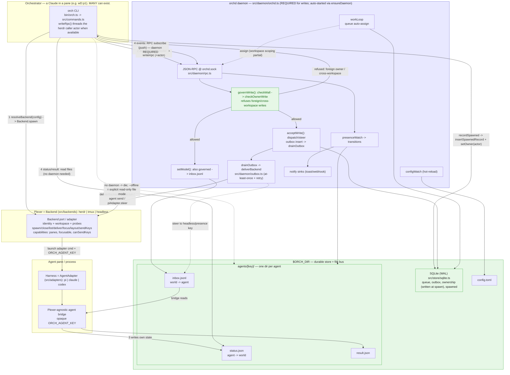

# orch — current (as-built) architecture

Verified against disk 2026-07-15 (working tree, tests 231/0). Proof lines in `doc-consistency-checklist.md`.

Solid arrows = normal flow. Agent control-message writes (dispatch/steer/model) are **brokered, durable, AND governed** — they go through the daemon, which enforces the workspace wall + ownership before accepting them. Agent self-report files and other local CLI mutations are not all daemon-brokered.

## What the daemon is now
The daemon is **the required broker for agent control-message writes** — `orch dispatch/steer/model/broadcast/pipe` all call `writeRpc()` (`src/commands.ts`), which `ensureDaemon()`s, threads the caller's actor id when present, and hits the RPC socket. These writes are:
- **Centralized** — one broker (`orchd`), not N direct herdr calls.
- **Durable** — dispatch/steer persist to the SQLite `outbox` before delivery, drain with retry + ack (`src/daemon/outbox.ts`), survive a restart. Real at-least-once messaging.
- **Governed when the caller has an actor identity** — `governWrite()` runs `checkWall()` then `checkOwnerWrite()` before an outbox insert or a model write (`src/daemon/orchd.ts:113-140`). A foreign-owned or cross-workspace write is refused unless the caller passes `--steal` / `--cross-workspace`; an unscoped caller still gets the wall check but skips ownership.

## The four flows (as-built)
1. **Spawn** — CLI resolves a **Backend** (herdr/tmux/headless), launches an **AgentAdapter** (pi/claude/codex), records a `spawned` row **and records the spawning orchestrator as the owner** (`recordSpawned` → `setOwner`).
2. **Write (dispatch/steer/model)** — CLI → `writeRpc` (with actor) → daemon RPC → `governWrite` (wall + ownership) → outbox → `deliverBackend`. Durable, brokered, **governed**.
3. **State (self-report)** — each agent's bridge writes its own `status.json`/`result.json`.
4. **Observe (READ)** — `status`/`result` read the presence files directly (no daemon needed). `events` **requires** the daemon: it subscribes to the socket and the daemon **pushes** transitions. No daemon → it `die()`s and points at `--offline`, an explicit opt-in read-only file-watch mode, *not* an automatic fallback.

## Governance details (wired, with one documented gap)
- Ownership is recorded at every spawn site; `writeRpc` threads the herdr caller actor when available; `governWrite` gates dispatch/steer/model on `checkWall` + `checkOwnerWrite` (`src/daemon/orchd.ts:109-140`).
- **Caveat:** a write with no actor (headless / not inside a herdr pane) skips the ownership check; the wall still runs with the unscoped actor (`orchd.ts:109-111`). Unscoped writers are wall-eligible by policy.

## The Bridge spine and backend port
The shipped architecture keeps the two axes independent: agent adapters (pi/claude/codex) and plexer backends (herdr/tmux/headless) vary independently. Each concrete plexer is an Adapter over its native tool; a registry plus `resolveBackend(config)` factory selects it (Provider Model).

The backend is the identity authority. Its PORT exposes `mintIdentity(handle)` → `{backend, workspace, handle}`, `isAvailable()`, `isInsideSession()`, `spawn(adapter, opts)`, `close(handle)`, and `list()`, plus delivery/control operations (`deliver`, `focus`, `sendKeys`, `applyLayout`). Capability flags `panes`, `focusable`, and `canSendKeys` gate unsupported operations. Workspace policy consumes the backend-reported workspace; no core code parses a plexer string.

Spawn mints the identity before the agent starts and passes its opaque serialized key in `ORCH_AGENT_KEY`. Bridges are plexer-agnostic and never read `HERDR_PANE_ID` (or another backend variable); backends are agent-agnostic. Presence uses the versioned flat key/record format documented in `docs/files-and-data-layout.md`.
