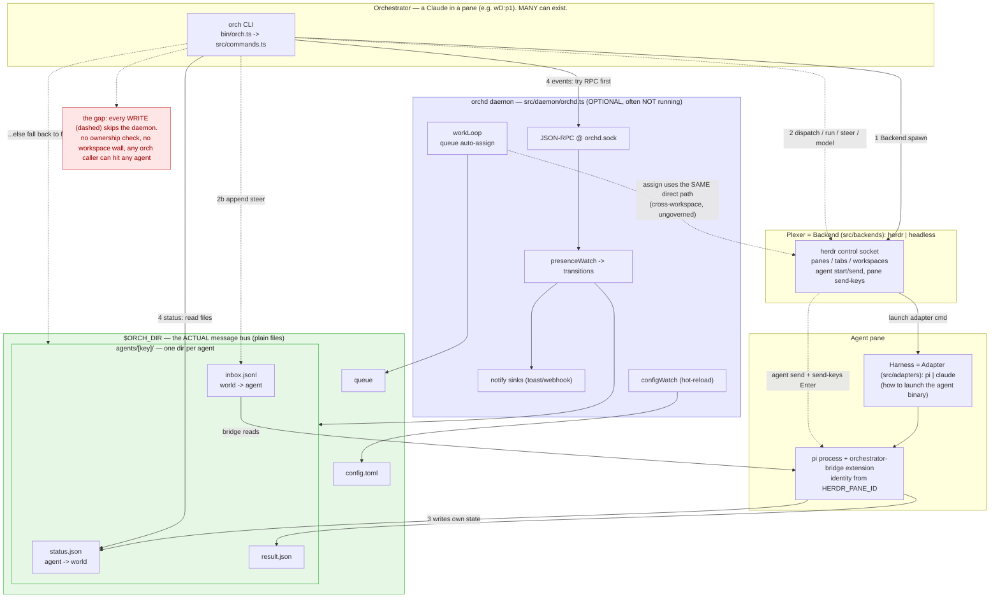

# orch — current (as-built) architecture

Solid arrows = normal flow. **Dashed red = write/dispatch path that BYPASSES the daemon (no wall, no ownership).**

## The four flows
1. **Spawn** — CLI calls a **Backend** (herdr/headless), which launches an **Adapter** (pi/claude). Backend = *where it runs* (plexer). Adapter = *what runs* (harness).
2. **Dispatch/steer (WRITE)** — CLI goes **straight to herdr** (`agent send` + `send-keys Enter`) or appends to `inbox.jsonl`. **The daemon is not in this path.** No wall, no ownership.
3. **State (self-report)** — each agent's bridge writes its own `status.json`/`result.json`. This is the file-based part you don't love — the agent *is* the source of truth, files *are* the bus.
4. **Observe (READ)** — `status` reads files; `events` tries the daemon RPC then **falls back to file-watch**.

## Harness vs Plexer
- **Plexer / Backend** (herdr, headless): owns panes/tabs/**workspaces** and process placement.
- **Harness / Adapter** (pi, claude): owns how the agent binary is invoked.
- **Workspace identity** today = parsed from `HERDR_PANE_ID` (`ws:pane`) — herdr-coupled, not abstracted.

## Where the daemon actually sits
It only **watches** (presence→notify) and **auto-assigns** (workLoop→queue). It brokers **nothing** on the write path — which is why dispatch is ungoverned and why the workLoop pulls agents across workspaces.
