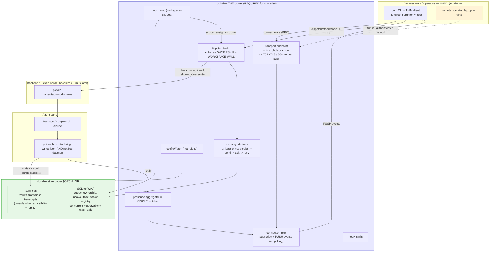

# orch — TARGET architecture (daemon as broker)

Compare with `orch-architecture-current.md`. The move: everything that today goes *beside* the daemon now goes *through* it. Socket for live push, durable store underneath, writes brokered + governed.

## What MOVES (beside -> inside the daemon)

| concern | today (beside) | target (inside broker) |
|---|---|---|
| dispatch / steer / model | CLI -> herdr direct, ungoverned | RPC -> broker, ownership + wall enforced |
| live events | every CLI file-watches / polls `/mnt` | one socket, daemon pushes |
| workLoop assign | cross-workspace, direct path | workspace-scoped, through broker |
| message durability | fire-and-forget into inbox.jsonl | persist -> send -> ack -> retry (at-least-once) |
| presence watching | N watchers | 1 aggregator in the daemon |
| when daemon is down | writes sneak through direct path | writes REFUSE (reads still file-fallback) |

## Design principles baked in
- **Socket for live, store for durable.** Push over `orch.sock`; nobody polls files. jsonl stays as the durable/visible log + replay source.
- **At-least-once messaging.** Steers/dispatches are persisted before send, acked by the agent, retried on failure, and survive a daemon restart. No lost messages.
- **Reconnect replay.** Clients track a sequence number; on reconnect the daemon replays missed transitions from the log.
- **Transport-agnostic from day one.** RPC semantics don't assume a unix socket — the same protocol swaps to TCP+TLS or an SSH tunnel for the long-term cross-machine goal (laptop steering a VPS) without changing call sites.
- **Governance is free.** Because writes go through one broker, ownership + workspace walls live in exactly one place.
- **Reads stay resilient.** `status`/`events` prefer the socket but fall back to file-watch — daemon absence degrades *reads*, and *refuses* writes.
