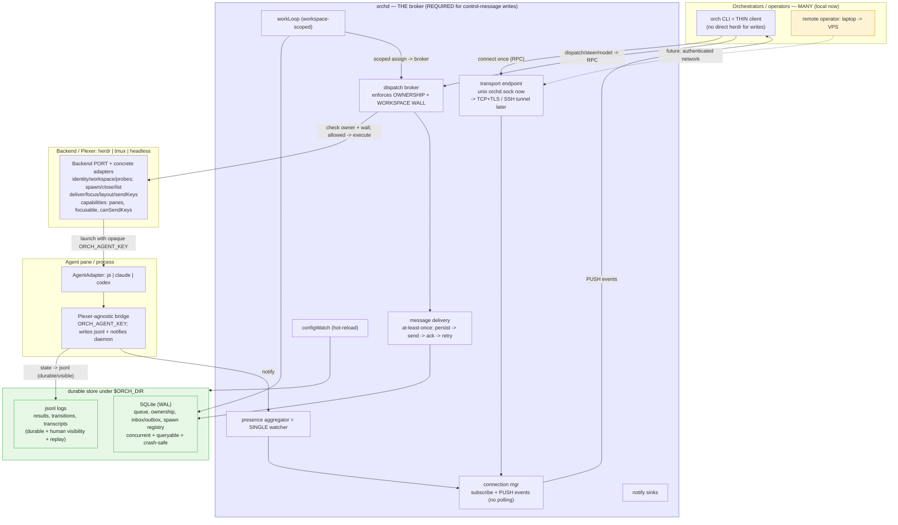

# orch — TARGET architecture (daemon as broker)

Compare with `orch-architecture-current.md`. The target moves agent control-message writes that today go *beside* the daemon *through* it. Socket for live push, durable store underneath, control writes brokered + governed.

## Status (as of 2026-07-15)

The broker, durable outbox, governance (ownership + workspace wall, with `--steal`/`--cross-workspace` overrides), backend Bridge, versioned flat presence identity, and in-memory sequence replay are IMPLEMENTED. What remains toward this target is: transport-agnostic remote TCP/TLS or SSH transport, durable replay beyond the daemon's in-memory window, and workspace-scoped workLoop assignment.

## What MOVES (beside -> inside the daemon)

The left column describes the pre-broker design; the current implementation already has the marked brokered behavior.

| concern | historical pre-broker baseline | target (inside broker) |
|---|---|---|
| dispatch / steer / model | CLI -> herdr direct | ✅ RPC -> broker, ownership + wall enforced |
| live events | daemon RPC push for normal mode; explicit `--offline` file-watch diagnostics | one socket, daemon pushes |
| workLoop assign | cross-workspace, direct path | workspace-scoped, through broker (still partial) |
| message durability | fire-and-forget into inbox.jsonl | ✅ persist -> send -> ack -> retry (at-least-once) |
| presence watching | N watchers | 1 aggregator in the daemon |
| when daemon is down | writes refuse; `status` still reads files; `events` requires the daemon unless explicit `--offline` | ✅ writes REFUSE; status remains file-readable, events remains daemon-only by default |

Ownership + wall enforcement and durable at-least-once messaging are now IMPLEMENTED as of this change.

## Bridge and backend selection
- **Bridge is the spine.** Agent adapters and plexer backends are independent hierarchies; no agent × plexer pair classes. Concrete backends adapt foreign CLIs, while the registry plus `resolveBackend(config)` factory selects the configured provider.
- **The backend owns identity.** `mintIdentity(handle)` reports `{backend, workspace, handle}`; `isAvailable()` and `isInsideSession()` probe the selected backend. The port also owns `spawn`, `close`, `list`, delivery/control operations, and capability flags `panes`, `focusable`, `canSendKeys`.
- **Opaque identity crosses the bridge.** Spawn passes the serialized key as `ORCH_AGENT_KEY`; bridges never read `HERDR_PANE_ID` or other plexer variables. Workspace walls use the backend-reported workspace.

## Design principles baked in
- **Socket for live, store for durable.** Push over `orch.sock`; nobody polls files. jsonl stays as the durable/visible log + replay source.
- **At-least-once delivery attempts.** Steers/dispatches are persisted before backend delivery, marked delivered only when the backend reports success, retried on failure, and pending rows survive a daemon restart. Agent-level acknowledgement is not yet a protocol guarantee.
- **Reconnect replay.** Clients track a sequence number; on reconnect the daemon replays missed transitions from the log.
- **Transport-agnostic from day one.** RPC semantics don't assume a unix socket — the same protocol swaps to TCP+TLS or an SSH tunnel for the long-term cross-machine goal (laptop steering a VPS) without changing call sites.
- **Governance is centralized for control messages.** Because dispatch/steer/model go through one broker, ownership + workspace walls live in exactly one place.
- **Reads are selectively resilient.** `status` reads presence files without the daemon. Normal `events` requires daemon-pushed transitions; `--offline` explicitly opts into read-only file watching. Daemon absence refuses writes.
